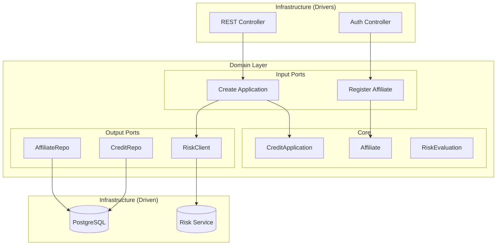

# CoopCredit - Credit Management System

CoopCredit is a microservices-based system designed to automate the credit application and evaluation process for a financial cooperative. Built with Spring Boot and Hexagonal Architecture, it ensures robust domain logic isolation, scalability, and security.

## Architecture

The solution follows the **Hexagonal Architecture** (Ports and Adapters) pattern:

-   **Domain Layer**: Core business logic, pure Java POJOs (Affiliate, CreditApplication, RiskEvaluation). No framework dependencies.
-   **Ports**: Interfaces defining Inbound (Use Cases) and Outbound (Repositories, External Services) interactions.
-   **Infrastructure Layer**: Adapters implementation (JPA Repositories, REST Controllers, Security).

### Architecture Diagram



### Microservices

1.  **credit-application-service**: The core service managing affiliates, applications, and orchestration.
2.  **risk-central-mock-service**: A simulation of an external risk bureau.

### Tech Stack

-   **Java 17**
-   **Spring Boot 3.2+** (Web, Data JPA, Security, Actuator, Validation)
-   **PostgreSQL** (Remote Database on Supabase)
-   **Docker & Docker Compose** (Containerization)
-   **Flyway** (Database Migrations)
-   **MapStruct** (Object Mapping)
-   **JWT (JJWT)** (Stateless Authentication)
-   **Testcontainers** (Integration Testing)

## Getting Started

### Prerequisites

-   Docker and Docker Compose
-   Java 17+ (for local development)
-   Maven (for local development)

### Execution

1.  **Build and Run with Docker Compose**:
    ```bash
    docker-compose up -d --build
    ```
    This will start:
    -   Credit Service on port `8090` (Connected to Supabase)
    -   Risk Service on port `8081`

3.  **Access Documentation (Swagger UI)**:
    -   URL: `http://localhost:8090/swagger-ui.html`
    -   Use this interface to authorize with your JWT and test endpoints easily.

2.  **Verify Services**:
    -   Credit Service Health: `http://localhost:8090/actuator/health`
    -   Risk Service Health: `http://localhost:8081/actuator/health`

3.  **Stop Services**:
    ```bash
    docker-compose down
    ```
    This stops and removes the containers and networks. To just stop them without removing:
    ```bash
    docker-compose stop
    ```

## Usage & Flows

### Roles

-   **ROLE_AFILIADO**: Can register and create own credit applications.
-   **ROLE_ANALISTA**: Can evaluate applications (Access to PENDING applications).
-   **ROLE_ADMIN**: Full access.

### Risk Evaluation Logic (Mock Service)
The mock service uses a deterministic algorithm based on the document number:
-   **Seed**: `document.hashCode() % 1000`
-   **Score Range**: 300 - 950
-   **Levels**:
    -   300-500: **ALTO RIESGO** (Rejection)
    -   501-700: **MEDIO RIESGO**
    -   701-950: **BAJO RIESGO** (Approval)

### Credit Policies
-   **Seniority**: Minimum 6 months.
-   **Capacity**: Monthly payment <= 30% of Salary.
-   **Amount**: Max 10x Salary (customizable).

### Main Use Cases

1.  **Register Affiliate**:
    -   `POST /auth/register`
    -   Creates a User and an Affiliate record.
2.  **Login**:
    -   `POST /auth/login`
    -   Returns a JWT Token.
3.  **Create Credit Application**:
    -   `POST /applications` (Authed)
    -   Creates an application and triggers automatic risk evaluation.

### Example Requests

**Register:**
```json
POST /auth/register
{
  "name": "John Doe",
  "email": "john@example.com",
  "document": "1001",
  "salary": 5000000,
  "address": "Main St",
  "startDate": "2023-01-01",
  "password": "secretPassword",
  "role": "ROLE_AFILIADO"
}
```

**Login:**
```json
POST /auth/login
{
  "username": "1001",
  "password": "secretPassword"
}
```

**Create Application:**
```json
POST /applications
Headers: Authorization: Bearer <TOKEN>
{
  "affiliateId": 4, 
  "amount": 2000000,
  "term": 12
}
```
*Note: Logic checks rules (Salary, Active status, Seniority).*

**Evaluate Application (Analyst Only):**
```json
POST /applications/{id}/evaluate
Headers: Authorization: Bearer <ANALYST_TOKEN>
(Empty Body)
```

## Testing

For local testing:
```bash
mvn test
```
(Requires Postgres available or Testcontainers will spin one up if Docker is running).
